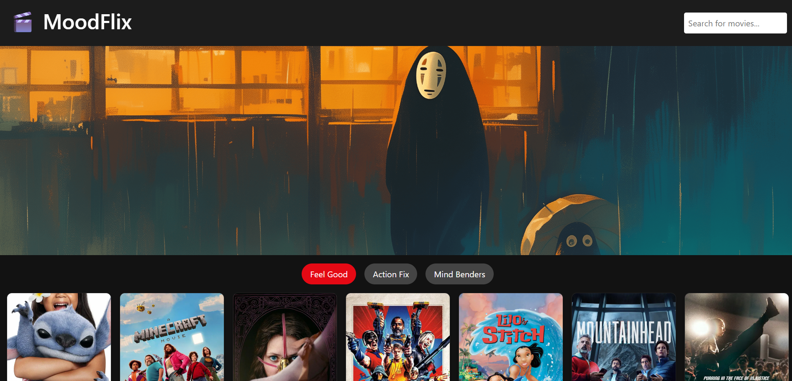

# 🎬 MoodFlix - TMDB Movie Discovery App

MoodFlix is a responsive Angular-based movie discovery application that fetches movie data from [The Movie Database (TMDB)](https://www.themoviedb.org/). It allows users to explore movies based on moods (genres), search for specific titles, view movie details, add/remove from watchlist, and much more.

## 🚀 Features

- Responsive UI using **Bootstrap**
- Mood-based movie browsing (e.g., *Feel Good*, *Action Fix*, *Mind Benders*)
- Lazy-loaded landing page
- Movie detail view with:
  - Movie info
  - Cast
  - Similar movies
- Search with debounce and genre auto-detection
- Add/Remove movies from **Watchlist** using `localStorage`
- Pagination and navigation controls
- Modular standalone components (cards, headers, etc.)

## 🧰 Tech Stack

- Angular 17+
- RxJS
- Bootstrap 5
- TMDB API

## 📝 Prerequisites

- [Node.js](https://nodejs.org/) (v18 or above)
- [Angular CLI](https://angular.io/cli)

## 🔑 TMDB API Key Setup

1. Go to [TMDB Developers](https://developer.themoviedb.org/) and create an account.
2. Visit [API section](https://www.themoviedb.org/settings/api) and generate an API key (v3 auth).
3. Create a file at `src/assets/config.json`:

{
  "tmdbApiKey": "YOUR_TMDB_API_KEY",
  "tmdbBaseUrl": "https://api.themoviedb.org/3"
}

## ⚙️ Installation and Setup

# Clone the repo
git clone https://github.com/your-username/tmdb-movie-app.git
cd tmdb-movie-app

# Install dependencies
npm install

# Run the application
ng serve

Visit http://localhost:4200 to view the app in your browser.

## 📷 Screenshots

## 📄 License
This project is licensed under the MIT License.